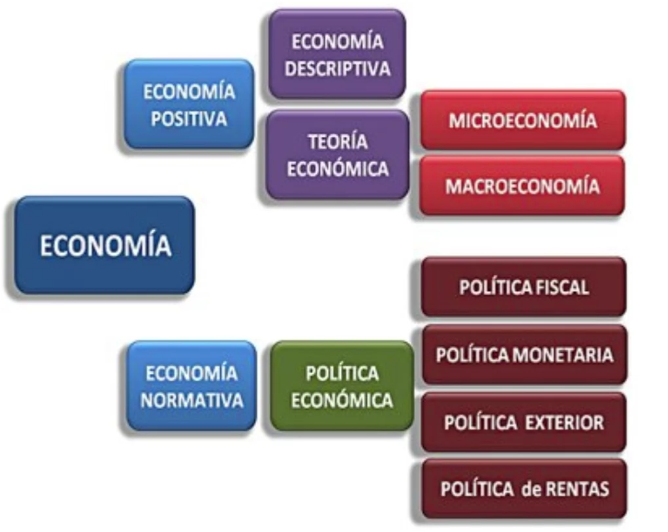
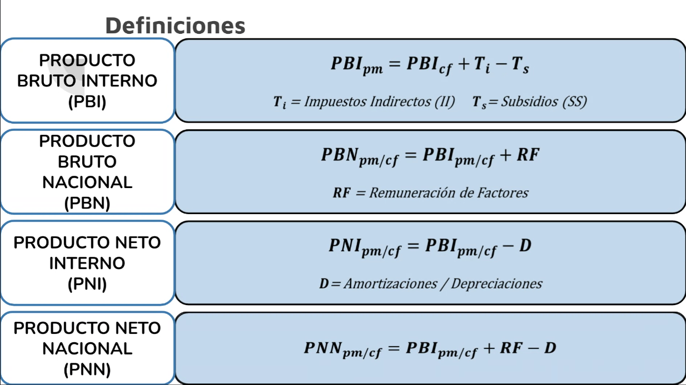

\newpage

# Empresas de Base Tecnológica

Los spin off son iniciativas empresariales que están promovidas por académicos/profesionales que deciden iniciar el camino emprendedor para que las capacidades o tecnologías que han desarrollado se puedan poner a disposición de la sociedad, a partir de su comercialización. Estas empresas basan su actividad en la producción y venta de nuevos procesos, productos o servicios de alto valor agregado que parten del conocimiento adquirido o los resultados obtenidos en el ámbito de la propia Universidad.

Proceso de creación de una EBT

- Identificación de una oportunidad tecnológica
- Validación del mercado: investigación de mercado, análisis de competidores y evaluación de la demanda
- Formación de un equipo multidisciplinario
- Desarrollo tecnológico: investigación y desarrollo, iteraciones y mejoras
- Búsqueda de financiamiento y recursos - Incubación y aceleración
- Consideraciones legales y de propiedad intelectual
- Vigilancia tecnológica

# Economía

Ciencia social que estudia como se administran los recursos para satisfacer las necesidades humanas, siendo que son escasos los recursos, y las necesidades humanas tienden a infinito (siempre voy a volver a tener hambre por más que coma). Se logra a través de:
    
        - Producción
        - Distribución
        - Comercialización
        - Consumo
    
de bienes. 

Pensamiento económico

Mercantilismo -> Fisiocracia -> Adam Smith -> David Ricardo -> Thomas Malthus -> Karl Marx -> John Keynes

Tipos de economía:

- De mercado o capitalista: los individuos y las empresas privadas toman las decisiones de producción y distribución.

- De Estado o planificada: el gobierno toma las decisiones de producción y distribución.

- Mixta: economía de mercado combinada con decisiones del Estado.

Son la gran mayoría mixtas, en menor o mayor medida.
Ejemplos de economia de Estado: Cuba, Corea del Norte.

## Microeconomía

Estudia el comportamiento, acciones y decisiones de los agentes económicos individuales: personas, familias y organizaciones; y sus relaciones e interacciones en los mercados.

## Macroeconomía

Estudia el comportamiento, la estructura y la capacidad de variables agregadas: Producto Bruto Interno, inflación, crecimiento económico, tasa de empleo y desempleo, tasa de interés, deuda privada y pública, etc.

## Factores de la producción

Recursos empleados para producir los bienes y servicios destinados a satisfacer las necesidades humanas.

| Factores              | Remuneración |
|-----------------------|--------------|
| Tierra                | Renta        |
| Trabajo               | Salario      |
| Capital               | Interés      |
| Empresario / Estado   | Beneficio    |

## Costo de oportunidad

Es la cantidad de otros bienes o servicios a la que se debe renunciar para obtener un bien o servicio. Por ejemplo al decidir estudiar full time, se renuncia a un salario obtenido si decidieramos estudiar part time o directamente no estudiar.

La frontera de posibilidades de producción muestra el óptimo de producción entre dos bienes. Hay que decidir entre los puntos óptimos cuál de ellos nos conviene más, nos redituará a futuro, siendo todos igual de eficientes.

Formas de aumentar la frontera de posibilidades de producción:

- Aumento del capital.
- Aumento de la fuerza laboral.
- Mejoras tecnológicas.
- Descubrimiento de nuevos recursos.

De no existir escasez -> no habría una FPP.
La FPP ilustra el concepto de Costo de Oportunidad.

El PBI mide el tamaño de una Economía. Es la suma de todos los bienes y servicios producidos en una economía en un determinado período de tiempo. 

PBI a precios constantes -> suma de los bienes pero a precios de un período base.

# Finanzas

Área de la Economía que estudia cómo se obtiene y administra el dinero. Incluye financiación, inversión, ahorro, tasas de interés y el valor tiempo del dinero; entre otros.

Tipos de finanzas:

- personales
- privadas 
- públicas
- internacionales

Diferencias entre economía y finanzas:

| Economía                            | Finanzas                        |
|-------------------------------------|---------------------------------|
| Producción y consumo                | Optimización de recursos        |
| Oferta y demanda                    | Flujos del dinero               |
| Inflación y recesión                | Análisis de inversiones         |
| Perspectiva académica               | Perspectiva práctica            |

