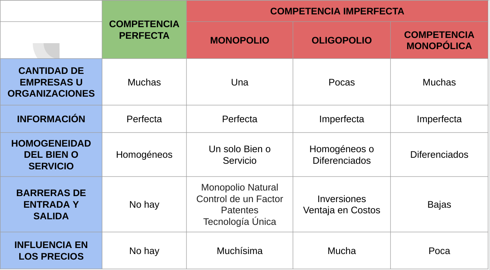

# Elasticidad

## Definición

Mide la sensibilidad de una variable con respecto a otra variable. Matemáticamente, es una cifra que nos indica la variación porcentual que experimentará una variable como respuesta a la variación de otra variable en un 1%.

## Elasticidad - Precio de la demanda

Mide la sensibilidad de la cantidad demandada a las variaciones del precio. 

$Ep = \frac{ \% \Delta Q}{ \% \Delta P}$

También se puede expresar como

$Ep = \frac{P}{Q} \cdot \frac{\Delta Q}{\Delta P}$

Normalmente es una cifra negativa. Normalmente, cuando sube el precio de un bien -> cantidad demandada disminuye => ΔQ/ΔP es negativo.

En general se trabaja con el valor absoluto de la elasticidad - precio.

## Tipos de demanda

# Mercados de competencia perfecta

Poseen las siguientes características:

- Gran cantidad de empresas.
- Se conoce toda la información con la que opera ese mercado.
- Los bienes y servicios que se comercializan son homogéneos.
- No hay barreras de entrada y salida.
- Ninguna empresa tiene el poder de mercado suficiente para influir en los precios.

# Mercados de competencia imperfecta
Este es el mundo real

## Monopolio

- Una sola Empresa u Organización.
- Se conoce toda la información con la que opera ese mercado.
- Se comercializa un solo bien o servicio.
- Es muy difícil o imposible entrar en ese mercado.
- Al ser una sola Empresa u Organización, ésta tiene todo el poder de mercado para influir en los precios.

Ejemplo: WhatsApp.

## Oligopolio

- Pocas Empresas u Organizaciones (generalmente 2 ó 3).
- No se conoce toda la información con la que opera ese mercado.
- Se comercializan bienes o servicios homogéneos o diferenciados.
- Es muy difícil o imposible entrar en ese mercado.
- Al ser pocas Empresas u Organizaciones, éstas tienen mucho poder de mercado para influir en los precios.

Ejemplo: Coca y Pepsi.

## Competencia monopólica

- Gran cantidad de Empresas u Organizaciones.
- No se conoce toda la información con la que opera ese mercado.
- Se comercializan bienes o servicios diferenciados.
- Bajas barreras de entrada y salida.
- Las Empresas u Organizaciones tienen poco poder de mercado para influir en los precios.

Ejemplo: Jeans.

