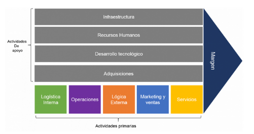

# Cadena de valor

## Definición

Representa el conjunto de actividades que una empresa realiza para crear, producir y entregar un producto o servicio específico a sus clientes.

## Importancia

Ayuda a las empresas a comprender cómo se crean los costos y el valor en cada etapa del proceso, lo que facilita la identificación de áreas de mejora de eficiencia, reducción de costos o diferenciar el producto, para obtener ventajas competitivas.

## Estructura / Tipos de Actividades

**Primarias**: están directamente involucradas en la creación y entrega del producto o servicio.

**De apoyo**: respaldan a las actividades primarias y son fundamentales para la eficiencia de toda la cadena de valor.

Concepto medio aparte:

**Dumping**: vender por debajo del valor por tiempo sostenido para deshacerse de la competencia.

## Estrategias

- Liderazgo en costos: reducir costos en las actividades de la cadena sin sacrificar calidad.

- Diferenciación: mejorar las actividades para ofrecer un producto o servicio único.

- Enfoque: especializarse en un segmento particular del mercado para satisfacer las necesidades específicas de ese nicho.

# Sistema de valor

## Definición

Interconexión **entre las cadenas de valor de múltiples empresas que trabajan juntas para crear valor.** Incluye a la empresa principal, proveedores, distribuidores y otros actores clave en la industria.
Abarca todo el ecosistema de negocios que influye en la capacidad de una empresa para ofrecer valor.

## Estrategias

- Colaboración estratégica: trabajar estrechamente con proveedores para mejorar calidad o reducir costos.

- Innovación compartida: colaborar con socios en la creación de nuevos productos o soluciones tecnológicas.

- Optimización logística: mejorar la eficiencia de la distribución.

- Satisfacción del cliente: integrar retroalimentación de los clientes para mejorar productos y servicios en toda la cadena de valor.

# Cuellos de botella

Son limitaciones o restricciones en un proceso que ralentizan el flujo de trabajo, reduciendo la eficiencia general. Pueden ocurrir en cualquier parte de una cadena de producción y su impacto es significativo, ya que impiden que el sistema funcione a su máxima capacidad.

Pueden ser **temporales o permanentes.**

## Características
1. Limitación en la capacidad: Una parte del proceso tiene menos capacidad o velocidad que las etapas anteriores o posteriores. Por esto, **se acumulen tareas o productos pendientes** en esa fase.
2. Reducción del rendimiento general: La **eficiencia del proceso completo está determinada por el ritmo del cuello** de botella. Aunque otras etapas sean más rápidas, el cuello de botella limita el rendimiento total.
3. Generación de acumulación: En un flujo de trabajo, los cuellos de botella provocan que el trabajo o los productos se acumulen antes de llegar a la etapa limitada, lo que puede causar sobrecarga o interrupciones.

# Costo

## Definición

Valor monetario de los consumos de factores que supone el ejercicio de una actividad económica destinada a la producción de un bien o servicio.

Todo proceso de producción supone el consumo de una serie de factores. Todo costo conlleva un componente de subjetividad que toda valoración supone. 

Una correcta contabilización de costos es básica a la hora de establecer proyectos empresariales y su viabilidad futura.

# Gasto

## Definición

Bienes y servicios adquiridos para la actividad de una empresa. Es un concepto asociado al momento de la adquisición de los factores, a diferencia del costo que es el gasto consumido en la actividad productiva.

Los costos se capitalizan, los gastos no.

La inversión viene del hecho de que ciertos gastos son consumidos en varios ejercicios.

# Costos

## Tipos

- Variables: cambian directamente con la cantidad producida o vendida.

- Fijos: permanecen constantes independientemente de la producción o ventas. (alquiler, sueldo, etc)

- Mixtos: combina elementos de costos fijos y variables. Estos pueden cambiar pero no directamente con la producción.

## Relación con el producto o servicio

- Directos e indirectos: los directos se pueden rastrear directamente a un producto o servicio. Los indirectos no se pueden asignar directamente y se distribuyen entre varios productos o servicios.

- De producción y operación: los costos de producción están relacionados con la fabricación de productos, mientras que los costos de operación incluyen gastos administrativos y de ventas.

## Importancia

- Los costos son cruciales para determinar el precio de venta de un producto o servicio.

- Ayudan a calcular el margen de contribución, que es la diferencia entre el precio de venta y los costos variables.

- Facilitan la toma de decisiones, como la fijación de precios, la expansión de operaciones o la discontinuación de productos/servicios.

