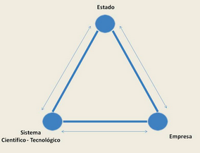

# Valor agregado

- No refiere al impuesto IVA
- Se refiere a la diferencia entre el valor total de los insumos/materia prima para producir el bien/servicio/el valor total del producto final.
- **No es la ganancia**. La ganancia es un concepto monetario, el valor agregado suele tener que ver con un concepto no tangible. 
	- Esta mas relacionado al concepto de ventaja competitiva
- Es el valor que se agrega a traves del proceso de produccion o servicio y representa **el aumento en el valor del producto**.

## Tipos

- Funcional:
  - Mejoras tecnicas que aumentan la funcionalidad del producto.
  - Ejemplo: Producto X tiene una valor agregado por encima de Y porque X puede hacer algo que Y no.
- Emocional:
  - El producto tiene una conexion emocional con el consumidor.
  - Ejemplo: Tal cerveza es sponsor de la seleccion y la tomo porque me hace acordar a cuando Francia se quedo con las ganas.
- Estetica:
  - El producto tiene una estetica superior a la del resto.
  - Ejemplo: El iPhone es mas *aesthetic* que el Android. <!-- Ay amiga, re grasa el android -->

Las ventajas *esteticas* y *emocional* son mas aplicables a productos de consumo masivo; no tanto a productos de Business a Business. Ejemplo: Salesforce no puede hacer uso de una ventaja emocional porque le venda a otras empresas (y las empresas son entes frios y sin sentimientos). Coca Cola en cambio, puede hacer uso de ambas, porque le vende al mercado masivo comun.
 
## Importancia

- Eficiencia:
  - Mayor es el valor agregado, mayor puede llegar a ser la eficiencia de la empresa. Sobre todo (y principalmente) cuando hablamos de valor agregado funbcional. Ejemplo: Si una empresa tiene una maquina que el resto no, esto le va a dar una ventaja por sobre el resto.
- Competitividad
  - Mas valor agregado tiene un producto, mas competitivo lo hace. Mas motivos le da al consumidor de comprarlo.
- Precio y Margen
  - Cuanto mayor es el valor agregado, mayor es el precio que los consumidores están dispuestos a pagar por el
- Satisfacción del cliente
  - Si el valor agregado se manifiesta en una mejor experiencia al cliente, mayor customizacion, mayor calidad, etc; el cliente queda mas contento. Y clientes contentos compran mas. <!-- Factos -->

## Valor agregado en el contexto de una EBT

El valor agregado es la posta de la milanesa en las EBTs. Viven y mueren por el valor agregado que estas ofrecen por sobre otras.

- Innovación tecnológica
  - Las EBT basan su modelo de negocios en innovaciones tecnológicas únicas o disruptivas que anaden valor significativo.
- Solución de problemas complejos
  - Se enfocan en resolver problemas complejos o mejoras significativas a las empresas. 
  - Es donde mas valor se puede añadir, ya que son los problemas mas dificiles de resolver.
- Escalabilidad
  - El valor agragado puede escalar rápidamente si la tecnología  que lo desarrolla escala con el
- Innovación continua
  - Constantemente mejorando. Se busca que el siempre haya valor a añadir
- Propiedad intelectual/Patentes
  - Las EBTs pueden conseguir muchos fondos con el uso de patentes. Ademas, están otorgan una ventaja competitiva por sobre la competencia.
- Ecosistema tecnológico
  - Las EBTs consiguen valor incorporandose con otras plataformas/tecnológicas ya existentes.
  - Si tu solución se integra con soluciones ya existentes, es mas fácil que se adapten estas soluciones.

# Incubacion y Aceleracion

## Ecosistema de innovacion

- Es el entorno colaborativo compuesto por actores que se relacionan entre sí.
- Interacuan de manera sinergica para impulsar la innovacion, crecimiento y la competitivdad. 
- Las EBTS **viven en este triangulo**. Interactuan con los 3 ejes

### Beneficios

- Fuente de crecimiento economico. Empleos de alta calidad y mejoras en el producto
- Competitivadad global. Ingresan a mercados globales mas competitivos donde se manejan divisas extranjeras. <!-- https://youtu.be/-E-FJjWfso8?si=gNwBWcewoYuXc7Qi&t=52 -->
- Soluciones a problemas sociales

## Incubadoras vs Aceleradores

Vamos a definirlos comparandolos <!-- Esto lo hace asi el profesor en clase. --> 

- Incubadoras:
    - **Pensadas para la etapa temprana de una empresa. "Los comienzos"**.
    - Suelen invertir dinero en la empresa, en la forma de compra de acciones/dueños de cierto porcentaje. Haciendose asi "socios"
- Aceleradores:
    - **Pensadas para empresas que estan en el "medio de su vida" y quieren acelerar el crecimiento**.
    - Ofrecen un servicio de apoyo y desarrollo a cambio de un pago por dichos servicios.
    - Muchas de estas son manejadas como fondo de inversion:
	    - Fondo de inversion: Vos pones tu guita en una "bolsa comun" y la empresa que maneja ese fondo lo invierte por vos; cobrando un porcentaje.
	
### Proceso de Incubacion
1. Identificación de una oportunidad tecnológica -> Idea
2. Validación del modelo de negocio -> investigación de mercado, análisis de competidores y evaluación de la demanda. 
3. Mentoría y asesoramiento -> Formación de un equipo multidisciplinario
4. Desarrollo tecnológico -> I+D, iteraciones y mejoras
5. Búsqueda de financiamiento y recursos -> Red de contactos. Armado de pitchs.
   5. Pitch: Discurso de 4 a 5 mins en donde presentas tu idea a inversores. 
6. Consideraciones legales y de propiedad intelectual
7. Vigilancia tecnológica

### Proceso de Aceleracion

Acá no hay un orden tan "lineal" como en la incubacion

- Crecimiento Rápido -> Aceleración
- Acceso a Recursos -> financiamiento privado y público
- Red de Contactos -> inversores, expertos en la industria y otros emprendedores
- Validación de Mercado -> validar su modelo de negocio y su producto en el mercado
- Programas Estructurados -> capacitación intensiva, eventos de networking y oportunidades para presentar su empresa a inversores.
- Objetivo de Financiamiento -> rondas de negocios e inversores

## Estado de desarrollo	TRL

Existe "cierta escala" para "medir" el estado de desarrollo de una EBT llamado TRL

- 1 - 3: Etapa inicial/investigación
- 4 - 6: Desarrollo
- 7 - 9: Deployment

