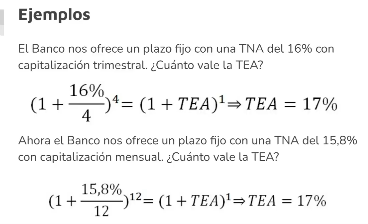

# Finanzas

## Definición

Área de la Economía que estudia cómo se obtiene y administra el dinero (capital). Esto incluye la financiación, la inversión, el ahorro, las tasas de interés y el valor tiempo del dinero entre otros.

Se trabaja con flujos netos de dinero expresados en efectivo que van hacia (+) y desde (-) la empresa.

Obtener estos flujos netos es clave ya que con estos se calculará el Valor de la Empresa.

El objetivo de la empresa es **maximizar el valor de la misma** y la toma de decisiones estará centrada en este objetivo.

No es conveniente utilizar como objetivo la maximización de utilidades ($/periodo) por la ambigüedad del período de referencia, la omisión de considerar el riesgo de dicha utilidad y por la no consideración de los negocios futuros en la meta.

$V = \displaystyle{\sum_{t=1}^{\infty}} \frac{FF_t}{(1 + \text{Costo del dinero})^t}$

Con:
- FFt: Flujos de Fondos. Todo el dinero que entra y sale
- Costo del dinero: Tasa de interes
- t: Periodos que evaluo

El costo del dinero será el costo de oportunidad perdido por estar en este negocio y no en otro negocio del mismo riesgo.

## Valor del dinero

Un peso hoy vale más que un peso mañana. Esto es así porque:

- Puedo invertir ese peso para generar un rendimiento, de manera tal que mañana valdrá más que lo que vale hoy.
- Al peso de hoy no lo afectará la inflación ni el riesgo de mañana.
- Me permite satisfacer una necesidad o deseo hoy. (Comer, pagar las deudas, etc).

## Valor nominal del dinero

Es el valor que tiene este en un momento determinado del tiempo sin considerar otras variables como la tasa de interés, la inflación, el tipo de cambio, etc.
Es un valor incompleto porque ignora factores importantes como el tiempo y el lugar. No es lo mismo 100 dolares en Argentina que en Hong Kong. No es lo mismo 100 dolares hoy que hace 100 años.

## Valor tiempo del dinero

Es el valor de este teniendo en cuenta que una misma suma de dinero vale más hoy que en el futuro debido a que, en el presente, puedo tomar ese dinero y ponerlo a generar rendimientos a futuro.

$VF = VP (1+i)^n$

Con:
- i: Tasa de interes
- n o t: Periodos que evaluo

## Tasa de interés

Representa el costo del dinero en un período de tiempo determinado. Tambien se utiliza como medida de riesgo de una inversión.

A mayor riesgo mayor tasa de interés.

## Interés simple

No se compone con el capital para generar nuevos intereses sino sino que siempre el capital original es el que trabaja a la tasa.

Tus ganancias por intereses anteriores no las vas "vas a incluir" en nuevas inversiones.

Es por esto que tiene un crecimiento **lineal**.

$VF = VP ( 1 + n \cdot i)$

Interes al cabo de n periodos: 
$V = \displaystyle{\sum_{t=1}^{n}} I_n$

## Interés compuesto 

Se ganan intereses sobre la suma inicial, luego sobre la suma incial más los intereses ganados en el primer período que el dinero trabajo y así sucesivamente. Siempre se suma el interés al capital para ganar más intereses.

$VF = VP \cdot (1+i)^n$

Interes al cabo de n periodos es:
$I = VF - VP$

## Tasa Nominal Anual

Es la tasa de interés que se declara en las operaciones financieras, en la documentación legal, con fines comerciales, etc.

El problema de trabajar con la TNA es que la información que brinda es incompleta ya que no menciona la cantidad de veces que los intereses se capitalizan en el año.

## Tasa Efectiva Anual

Es la tasa de interés que incluye la cantidad de veces que los intereses se capitalizan en el año. Son las tasas que realmente pagamos y/o cobramos y son las que nos interesa conocer.
Suele ser *mayor* que la TNA.

## Tasas equivalentes

Tasas nominales distintas que al transformarlas a tasas efectivas en un mismo período de tiempo nos dan el mismo valor, estamos hablando que son tasas equivalentes.

## Capitalizaciones
Los intereses se convierten en capital `n` veces al año. Algunos ejemplos:
- Trimestral: Se capitaliza 4 veces al año.
- Mensual: Se capitaliza 12 veces al año.
- Anual: Se capitaliza 1 vez al año.

## De TNA a TEA

