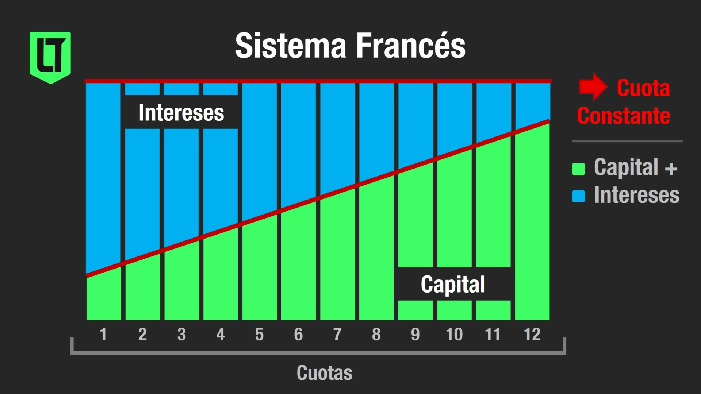
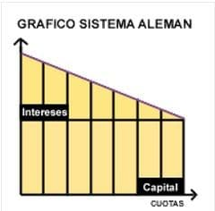
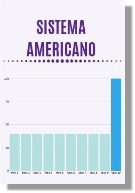
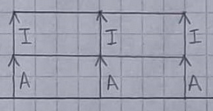

# Tiempo y asignación de recursos

## Pasaje de tasas

$(1+TEA)^1 = (1+TEM)^12 = (1+TEX)^Y$

siendo TEX la tasa equivalente en un período determinado e Y la cantidad de veces que ese periódo entre en un año.

## Flujo de efectivos múltiples

Cuando se quiere conocer el valor presente o futuro de un flujo de dinero que posee diferentes valores, se llevan todos los flujos de dinero a la fecha buscada y se suman algebraicamente

## Anualidades

Cuando un flujo múltiple de dinero cumple con:

- Todas las cuotas son iguales.
- Todas las cuotas están separadas a la misma distancia de tiempo.
- El signo de todas las cuotas son iguales.
- Todas las cuotas tienen las mismas tasas.

### Valor presente

$VP = C \cdot f_i^n = C \cdot \dfrac{(1+i)^n-1}{(1+i)^n \cdot i}$

C: cuota mensual a pagar
f: factor (siempre menor a n)

## Perpetuidades

Cuando n tiende a infinito, se habla de una perpetuidad.

$VP = \dfrac{C}{i}$

## Devolución de prestamos

Un préstamo es una operación financiera en la cual un ente presta una cantidad de dinero determinada a otro ente y este se compromete a devolverlo mediante un documento legal que fija las cuotas, intereses, el tiempo en que debe devolverse y las penalidades en caso de incumplimiento.

Prestamos se componen de cuotas y estas tienen dos partes: amortizaciones que representa el capital prestado y el interés que repsenta el costo de ese dinero prestado.

### Tipos

#### Sistema francés

En cada período, el valor de la cuota es el mismo pero varía la proporción de amortización e interés: en las primeras cuotas la proporción de interés sobre la cuota es mayor y va disminuyendo período a período. 

Los intereses que pago período a período se calculan en base a la amortización que me falta pagar.

#### Sistema alemán

En cada período, el valor de la cuota disminuye pero la amortización que se paga siempre es la misma.

Los intereses que pago período a período se calculan en base a la amortización que me falta pagar.

Suele utilizarse para préstamos entre empresas.

#### Sistema bullet

En cada período se paga la cuota que solo se compone del interés correspondiente y en el último período se paga todo el préstamo.

Los interes que pago período a período se calculan en base a la amortización que me falta pagar, en este caso todo el préstamo.

Suele utilizarse en grandes negocios en los que el dinero se cobra todo junto en un mismo período.

#### Sistema directo

Los intereses se calculan directamente sobre la deuda original. Hablamos de un sistema de amortización constante e intereses constantes.

Es el préstamo que ofrecen las entidades conocidas como efectivo rápido.

## Refinanciación de préstamos

Se deberá calcular cuál es la deuda en la fecha que se dejo de pagar. Esta suma se tratará como si fuese un nuevo préstamo, eventualmente con un método distinto de devolución de préstamos, con otra tasa de interés y otros plazos.

## Tasas de interés e inflación

Se debe revisar el cálculo de las tasas de interés. La tasa efectiva es nominal respecto de la inflacion; por lo tanto, debemos calcular el efecto de la inflación en las tasas para obtener la tasa real.

$1 + tasa real = \dfrac{1 + tasa efectiva}{1 + tasa de inflación}$ 

