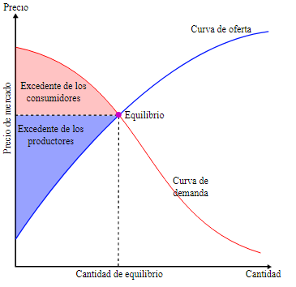

# EBT

## Clase 26/08

### Mercado

#### Definición

Lugar donde los compradores y los vendedores realizan un intercambio de bienes y servicios con el fin de satisfacer sus necesidades.

Estos intercambios, en la mayoría de los casos, se realizan con dinero como moneda de intercambio.

El precio (P) y la cantidad (Q) son las dos variables más importantes que tiene el mercado.

#### Características

- La cantidad de empresas que participan en el mercado.
- La capacidad de diferenciación o sustitución de los productos o servicios.

    - Diferenciación: un mismo producto es vendido por múltiples empresas, asique cada una busca como destacar por sobre la competencia.
    - Sustitución: el precio de la carne se va al carajo asique reemplazo la compra de carne por compra de pescado.

- El poder de las empresas de fijar el precio en el mercado.

    Una empresa tiene la capacidad de fijar un precio si tiene la mayoría de ventas (mayoría por bastante).

- Las barreras de entrada y de salida del mercado.

### Ceteris Paribus

#### Definición

Término latín que significa _todo lo demás constante_.

Este término se utiliza en Economía para analizar la variación de una variable dependiente cuando varía una variable independiente, suponiendo como constantes al resto de las variables independientes (derivada parcial).

### Demanda y Ley de la Demanda

#### Definición Demanda

Cantidad de bienes o servicios que los demandantes están dispuestos a adquirir, a diferentes precios, en un determinado período de tiempo.

##### Definición Ley de la Demanda

Establece que existe una relación entre el precio y cantidad demanda de un bien.

###### Demanda vs cantidad demandada

Demanda: relación entre un rango de precios.

Cantidad demandada: punto específico en la curva de demanda.

### Oferta y Ley de Oferta

#### Definición Oferta

Cantidad de bienes o servicios que los vendedores están dispuestos a vender, a diferentes precios, en un determinado período de tiempo.

#### Definición Ley de la Oferta

Estable que existe una relación directa entre el precio y cantidad ofertada de un bien.

### Equilibrio

Cuando las curvas de oferta y demanda se cruzan, hablamos del punto de equilibrio.

Cuando una empresa tiene la capacidad de fijar precios, mueve la curva aumentando el precio de equilibrio, pero disminuyendo las cantidades que se compran.

Beneficios: área del rectángulo formado por precio y cantidad.

Ganancias: Beneficios - gastos de producción.

### Función de Demanda y de Oferta

Expresiones matemáticas que relacionan las cantidades demandas y ofrecidas de un bien o servicio con sus respectivos precios.

Las cantidades demandadas u ofrecidas no dependen únicamente del precio del bien o servicio.

#### Función de demanda

QD = f(PBS, Y, PS, PC, X)

PBS: precio del bien o servicio en cuestión.
Y: ingreso disponible.
PS: precio del bien o servicio sustituto.
PC: precio del bien o servicio complementario.
X: otras variables como gustos y preferencias del consumidor, tamaño del mercado, expectativas, etc.

#### Función de oferta

QO = f(PBS, PF, Z, X)

PF: precio de los factores de la producción.
Z: la tecnología.
X: la cantidad de organizaciones que ofrecen el mismo bien o servicio, expectativas económicas, etc.
