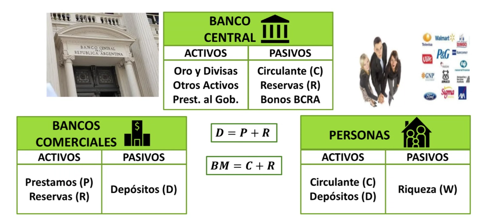

# EBT

## Clase 2/9

### Dinero

#### Definición

Activo o bien generalmente aceptado como medio de pago por los agentes económicos para sus intercambios. Activo financiero neutro o plenamente líquido, es decir, que solo el hecho de tenerlo implica que podes comprar activo o bien.

Tipos de dinero:

- mercancía.
- fiduciario.
- electrónico.
- signo.

#### Funciones

A. Medio de pago: cuando es requerido con el solo propósito de usarlo para intercambiarlo por otras cosas.
B. Unidad de cuenta: permite valorizar todos los bienes y servicios en una escala común.
C. Depósito de valor: morada temporaria del poder de compra.

#### Características

1. Liquidez: capacidad de un activo de convertirse en dinero sin perder su valor. Mas liquido es -> mas capaz de convertirse en dinero 
2. Rendimiento: remuneración debida a su posesión durante un determinado período de tiempo.
3. Riesgo: evalúa la posibilidad de afectar su calidad como reserva de valor.

##### Agregados monetarios

Cash (C): efectivo en manos del público es el valor de los billetes y las monedas en manos de los hogares y de las empresas no financieras de una economía.

Reservas (R): valor de los billetes y las monedas que los bancos y las cajas de ahorro de una economía tienen en depósito.

Depósitos (D): dinero del público depositado en el sistema financiero para su custodia o en busca de un interés.

    Cuentas corrientes (CC): permite ingresar dinero en el banco y que conlleva la obligación de este a devolverlo cuando inmediatamente cuando el cliente lo requiera.
    
    Cajas de ahorro (CA): cuenta que ofrece al cliente menos facilidades para realizar ingresos y pagos pero que presenta un tipo de interés.
    
    Plazo fijo (PF): permite obtener un rendimiento conocido y fijo a cambio de inmovilizar el dinero por plazo previamente pautado.

Tasa activa y tasa pasiva

Base monetaria: C + R

Oferta monetaria: C + D

    M1: C + CC
    M2: M1 + CA + PF < 1Y
    M3: M2 + PF > 1Y

#### Agentes

#### Motivos de demanda de dinero

Transacciones precaución y especulación.

#### Tasas de interés

Representa el costo del dinero en un período de tiempo determinado.

A mayor riesgo, mayor tasa de interés, el costo del dinero es alto.

### Inflación

#### Definición

Aumento sostenido del nivel general de precios en la economía durante un determinado período de tiempo. Este proceso va disminuyendo el poder adquisitivo.

#### Tipos

- Inflacion de demanda: se origina por un aumento en la demanda agregada por encima de la oferta agregada. Puede ser por un aumento en el consumo, la inversión, el gasto de gobierno, el salario real, la oferta monetaria o una disminución de los impuestos.

- Inflación de costos: se origina por un aumento en los precios. Puede ser por un aumento del salario nominal, un aumento del Mark Up o una disminución de la productividad.

- Inflación Inercial: se origina por las expectativas que tienen los agentes económicos de que se repita la inflación de los períodos anteriores. 

#### Soluciones para bajar la inflación

- Pacto social entre los agentes económicos para llegar a un acuerdo de precios y salarios.
- Corrección de los precios relativos.
- Metas de inflación reales.
- Evitar que el tipo de cambio fluctue bruscamente.
- Aumento de las tasas de interés-
- Moderar la emisión monetaria.
