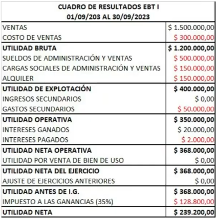

# EBT

## Clase 6/9

### Contabilidad
Creada por [Fray Luca Pacioli](https://es.wikipedia.org/wiki/Luca_Pacioli) 

#### Definición

Disciplina técnica que produce informes acerca del patrimonio de cualquier tipo de organización, y su evolución, para la toma de decisiones del ente, tanto internas como externas. Para lograrlo, se toman los actos económicos relativos al pasado, presente y los proyectados por la organización.

El patrimonio es un todo, lo bueno (:D) y lo malo (D:).

#### Objetivos

Brindar información sobre:

- Ejercicios pasados para realizar un análisis comparativo.
- El ejercicio presente para determinar:
  - La situación económica:
	 - Si la empresa es viable o no. Si hay rentabilidad y dinero para pagar las obligaciones.
  - La situación Financiera:
	- Cuanto dinero hay en caja
  - La situación Patrimonial.
	- Obligaciones, bienes y derechos.
	- "Un resumen de todo"
- El ejercicio futuro para proyectar los estados contables y tomar decisiones.

Vigilar que no se aumente demasiado el gasto, ver cómo avanzan las ganancias, como avanza la deuda, como avanzan los stocks, etc.

### Definiciones

- Hecho económico: 
	- Es todo hecho que modifica el patrimonio del ente
	- Un hecho de palabra **no** modifica el patrimonio, solo es como una _promesa_ de un hecho económico. Tiene que ser un hecho tanginble

- Patrimonio: totalidad de lo que posee un ente; es decir, bienes, derechos y obligaciones.

- Estructura patrimonial: es como se estructuran los bienes, derechos y obligaciones en la Contabilidad.

- Variaciones patrimoniales: movimientos en los informes contables originados por hechos ecónomicos.

### Balance

Estado contable que refleja el estado patrimonial de un ente durante un período determinado. Es una _fotografía_ de los bienes, derechos y obligaciones de un ente en un instante determinado.

Sigue la siguiente ecuacion:
- Activo = Pasivo + Patrimonio Neto
  - Activo: Bienes y derechos de una empresa
  - Pasivo: Obligaciones que tengo con terceros (Fisco, proveedores, sueldos de empleados, etc).
  - Patrimonio neto: Obligacones con los accionistas y/o duenos.

El balance refleja:
- Las inversiones del ente (Activos) 
- Como fueron financiadas dichas inversiones (Pasivos + Patrimonio neto).

Amortizaciones: 
  - Es la "Vida util contable" de un bien. Es **MENOR** que la vida util real/tecnica.
  - Guita que la contabilidad cuenta (xd) que va perdiendo valor los productos del patrimonio de la empresa (las PC que utilizan los empleados por ejemplo). Cada año contable, algunos bienes van perdiendo valor contable.
	- El auto el primer año vale 5000. El año siguiente vale 4000. Asi por 5 años hasta que pierde su valor contable (mas alla de que el auto esté impecable).

Usamos amortización lineal, si algo está amortizado es que ya perdió todo su valor.

La pérdida de valor está determinada por ley (AFIP), te indica como se amortiza cada bien. Los terrenos **no** se amortizan.

Mientras tengas el bien en tu patrimonio, sigue estando registrado por más que ya esté amortizado.

Fondo de comercio es es el valor actual de los superbeneficios que produce una empresa. Corresponde al valor inmaterial de esta derivado de factores como la clientela, la eficiencia, la organización, el crédito, el prestigio, la experiencia, etc. que le permiten obtener rentabilidades superiores a las esperadas por la simple suma de sus activos contables.

Lo que es financiero no se coloca cuando se carga un bien uso (si compré una maquinaria por 5000USD y la instalación vale 1000USD, lo cargo como 6000USD pero si para ello pedí un préstamo que con intereses termino costando 6200USD esos 200USD no se cuentan ahi, si no que va en otro lado).

### Cuadro de resultados

#### Definición

Estado contable que refleja las ganancias y pérdidas de un ente durante un período de tiempo. Está formado por todas las cuentas transitorias del período en cuestión. El resultado es la cuenta “Utilidades” que se ubica en el Patrimonio Neto y es la única cuenta transitoria del Balance.

Las utilidades representan las ganancias o pérdidas del ente en ese período.

- Costo: egresos asociados a la actividad principal.

- Gasto: egresos asociados a actividades secundarias.

Ejemplo con empresa de desarrollo de software

- Costo: sueldo de los desarrolladores de la empresa.

- Gasto: sueldo de los empleados de ventas y marketing.

Aspecto económico se ve reflejado en el cuadro de resultados y en la cuenta utilidades.

Aspecto financiero se ve reflejado en la cuenta disponibilidades.

Siempre se carga el precio al que uno compra, no al que vale.

### Secciones
Tiene diversas secciones. 

- Utilidad Bruta
- Utilidad y Explotacion
- Utilidad neta operativa
- Utilidad neta del ejercicio
- Utilidad antes de Ingresos Brutos
- Utilidad neta

### Tipos de cuentas

- Patrimoniales:
    - Activo
    - Pasivo
    - Patrimonio Neto
- Transitorias:
    - De resultados (ingreso / egreso)
    - De producción

### Activo

- Activo: bienes y derechos que posee la organización

derechos: pagar algo por adelantado

- Ordenamiento: las cuentas del Activo se ordenan en orden de liquidez descendente.

- Activo corriente: pueden ser convertidos en efectivo en menos de un año.

- Activo no corriente: no pueden ser convertidos en efectivo en menos de un año.

#### Cuentas patrimoniales del Activo

- Activo corriente:
        - Disponibilidades (Caja y Bancos)
        - Inversiones.
        - Créditos.
        - Bienes de Cambio.
- Activo no corriente:
        - Bienes de uso.
        - Amortizaciones acumuladas.
        - Cargos diferidos.
        
Solo pueden ser negativas amortizaciones acumuladas y cuenta utilidades (puede serlo, diferencia entre ingresos y egresos).

### Pasivo

- Pasivo: obligaciones hacia terceros que posee la organización.
- Ordenamiento: se ordenan en orden de liquidez descendente y por tipo d e acreedor.
- Pasivo corriente: exigibles en un plazo menor a un año.
- Pasivo no corriente: no son exigibles en un plazo menor a un año.

#### Cuentas patrimoniales del pasivo

- Pasivo corriente:
        - Deudas
            - Bancarias
            

Diferencia entre deuda provisión y previsión

|          |  Deuda   | Provisión | Previsión |        
|----------|----------|-----------|-----------|
| ¿Conozco el monto a pagar? |    Si    |     No    |    No     |
| ¿Conozco la fecha de pago?   |    Si    |     Si    |    No     |

Deuda: 
  - deuda xd. 

Provision: 
  - Ejemplo: Factura de luz perdida.
  - No sabes *cuanto* tenes que pagar, pero si cuando. Pones una cantidad "provisionada", estimando cuanto te va a costar.

Prevision: 
  - Ejemplo: gasto por despido.
  - Vos no sabes cuanto te va a costar (tal vez despedis a uno con mucha antigüedad y tiene mucha indemnizacion) ni cuando (puede que lo despidas ahora o en 7 meses).
  - Vos carga la cuentas contablemente, no financiaramente. Es para planificar mejor. No es que "moves la guita".

Cuentas transitorias de resultados

- Ingresos
- Egresos
- Producción
